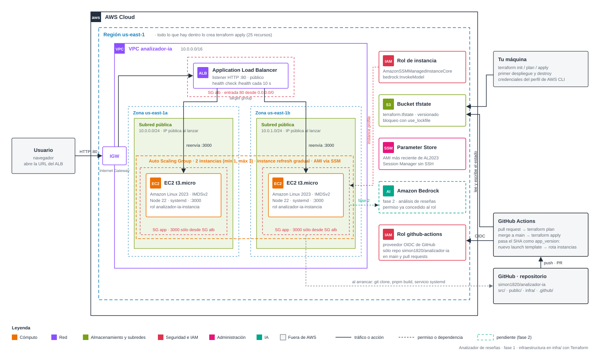

# Analizador de reseñas

Ejercicio de despliegue en AWS. Una app en Express + TypeScript que en la
fase 1 sólo demuestra el balanceo de carga: cada respuesta lleva la firma
de la instancia EC2 que la atendió y un interruptor permite tumbar su
health check para ver cómo el balanceador la saca de rotación. En la
fase 2 la app llamará a Amazon Bedrock para analizar el texto.

## Arquitectura



**Tráfico de usuario.** El navegador entra por HTTP al Application Load
Balancer, que reparte las peticiones entre dos instancias EC2 repartidas en
dos zonas de disponibilidad. El balanceador consulta `/health` cada diez
segundos y deja de enviar tráfico a una instancia que responda 503.

**Ciclo de vida de las instancias.** Un Auto Scaling Group mantiene dos
instancias t3.micro. Cada una, al arrancar, clona este repositorio, compila
y registra un servicio systemd en el puerto 3000. Las instancias no aceptan
SSH; se entra por Session Manager.

**Despliegue.** Toda la infraestructura está descrita en Terraform en la
carpeta `infra/`. El primer despliegue se hace desde tu máquina. Después,
GitHub Actions asume un rol por OIDC, guarda el estado en S3 y aplica los
cambios en cada merge a `main`. El SHA del commit viaja al user-data, así
que cada versión nueva del código genera un launch template nuevo y el
Auto Scaling Group reemplaza las instancias una a una.

Los pasos concretos están en [infra/README.md](infra/README.md).

## Desarrollo local

```bash
pnpm install
pnpm run build
pnpm start
```

La app queda en `http://localhost:3000`. Sin metadatos de EC2 se identifica
como `local`.

## Estructura

| Ruta | Contenido |
|---|---|
| `src/server.ts` | Servidor Express: identidad IMDSv2, health check, endpoint de análisis |
| `public/index.html` | Interfaz de la fase 1 |
| `infra/` | Terraform: red, balanceador, Auto Scaling, IAM, OIDC para GitHub |
| `.github/workflows/terraform.yml` | Plan en pull requests, apply en `main` |
| `docs/arquitectura.svg` | Diagrama de la arquitectura |
